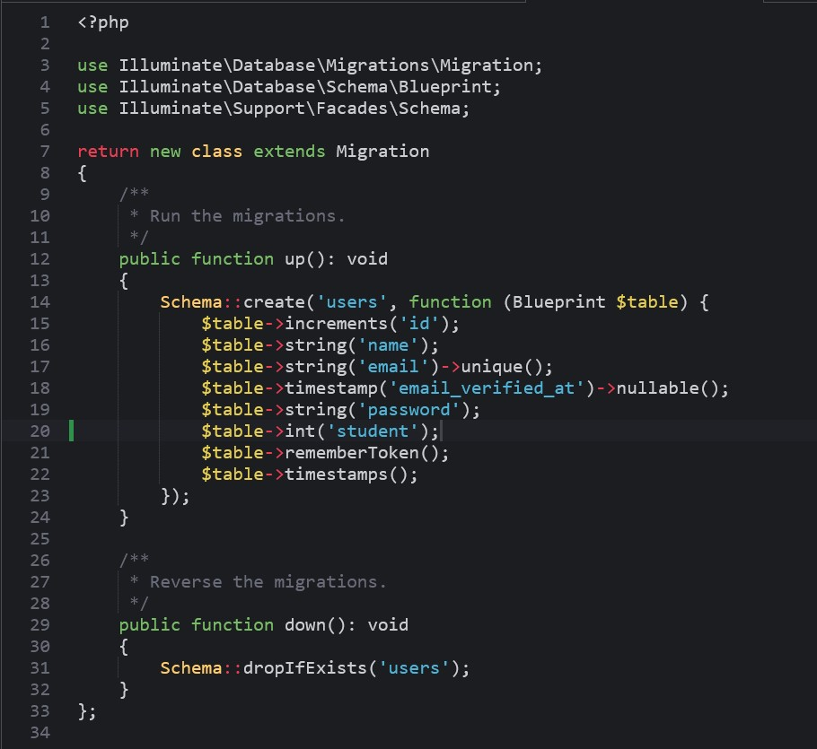
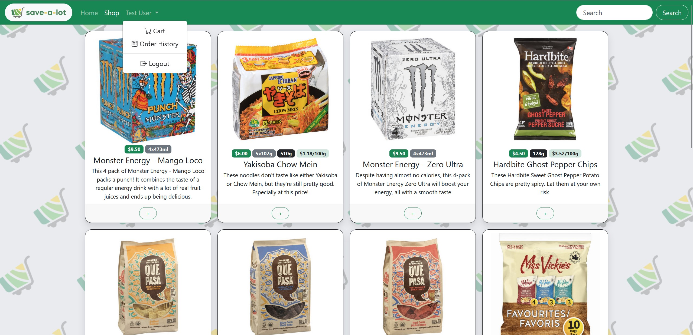
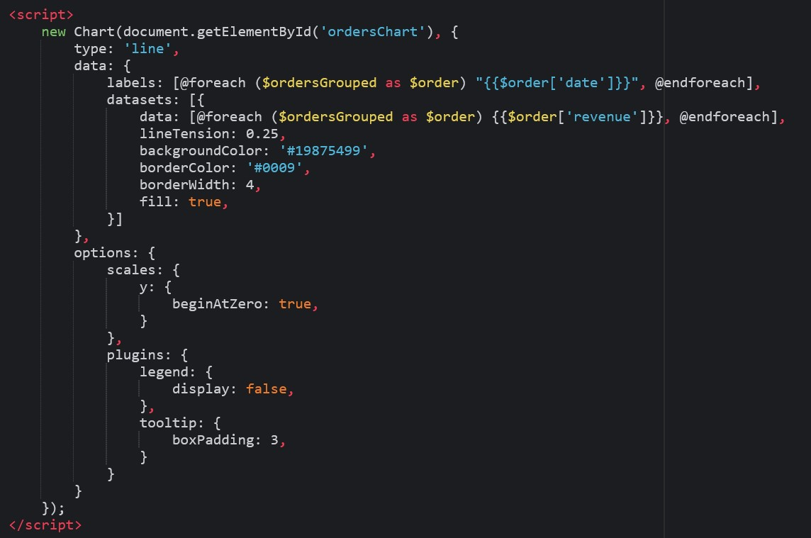
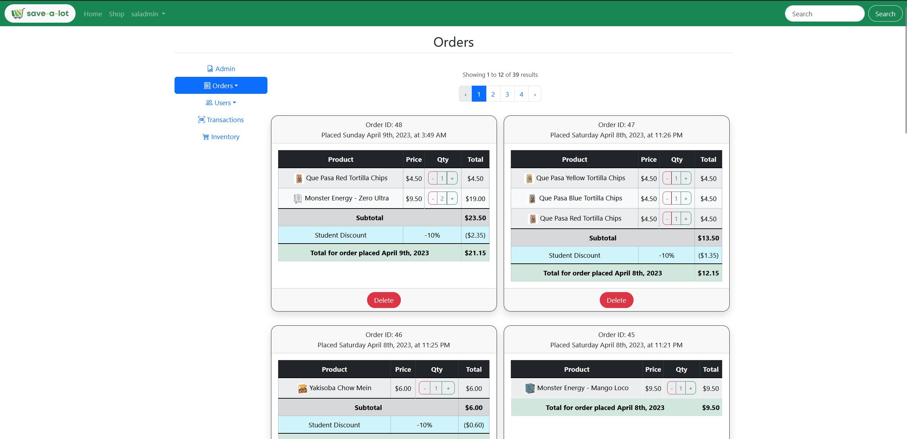
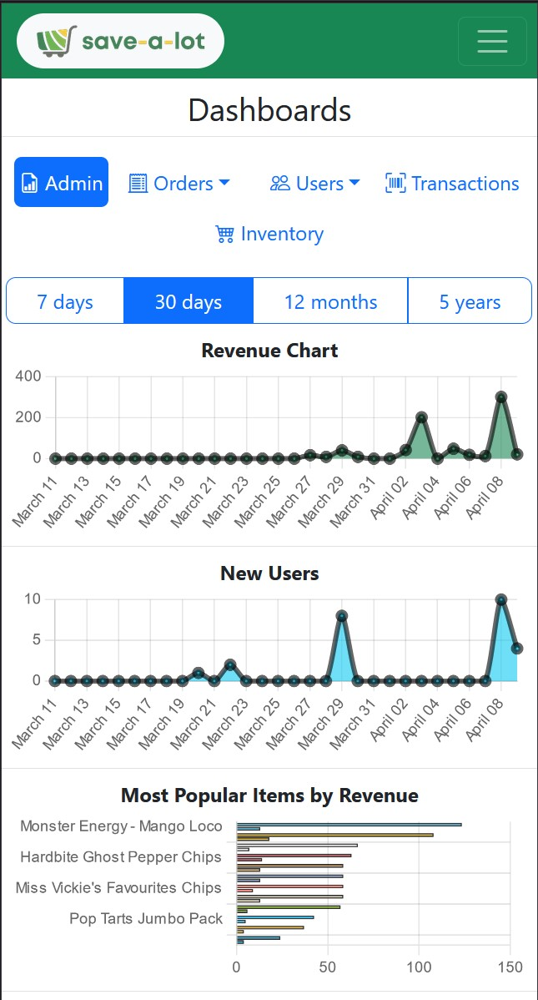

# Team 3 [Save-a-lot] - Official Documentation

## This documentation describes the components of the Save-a-lot application

## <ins>Team members</ins>

- Viet Anh (Bill) Nguyen
- Jacob McCallum
- Harkirat Singh
- Ovi Saha

****************************************

# I. Business Case
<br></br>


Save-a-lot is an online-exclusive grocery shop aiming to provide fresh and high-quality products with savings in mind. The target demographic includes everyone, however prioritizes students by offering a total 10% discount on their total order.

With Save-a-lot, you can get your groceries with just 3 easy steps:
- Step 1: Place your order on the layout-responsive website that works seamlessly on both desktop and mobile.

<br></br>
- Step 2: Visit a Save-a-lot local pick up sites and pay for your order.

<br></br>
- Step 3: Pick up your order and enjoy your fresh and affordable products!


<br></br>

# II. Functional and Non-functional Requirements

### <ins>Functional Requirements:</ins>
- Shop interface displaying products with their picture, size, price, quantity in stock, and description.
- Login and registration system to allow for personalized accounts and order histories.
- Cart system that allows for added items to be checked out.
- Admin function with business intelligence dashboards and inventory management.

### <ins>Non-functional Requirements:</ins>
- Software development framework that accommodates front end, back end, and database functions.
- Database system that store user data, inventory data, and transactional OLTP data.
- Server to deploy application.
- User-friendly interface that is engaging and easy to use.
- Software design principles to ensure software quality and security.
<br></br>

# III. System architecture and designs
### <ins>System architecture:</ins>
- Save-a-lot is developed using the Laravel PHP framework, which is a Model-View-Controller framework for software development. The diagram for the framework is described below:
<br></br>


### <ins>Sequence Diagram:</ins>

To understand how the MVC components interact with each other, below is a sequence diagram of the login and registration function as an example:
<br></br>


### <ins>Technology stack:</ins>
- Model: the database engine used in this application is the MariaDB MySql connector with PHPMyAdmin dashboard to manage CRUD activities.
- Controller: all controllers were created using Laravel PHP. Interactions between the controller and the model used Laravel Eloquent statements.
- View: all front end activities in the views were created using PHP, HTML, Bootstrap, CSS, and JavaScript.
- Developmental environment: AWS EC2 Instance, AWS Cloud9 IDE
- Graphics design tool: Canva
- Collaboration tool: GitHub, Google Drive

### <ins>Database Schema:</ins>
- The database system was designed using the Star schema with a fact table (orders) containing foreign keys as the hub, and dimension tables containing primary keys connected as spokes.
- While the database system achieved second normal form (2NF), the fact table does contain foreign fields to help with query efficiency. To avoid this problem in the future, the developments will separate the OLTP and OLAP database systems and employ an ETL process in between.
- Core database schema:
<br></br>

<br></br>

# IV. Implementation

## Route list
This is the list of routes and all controller functions that are associated with the routes
```
Route::view('/login', 'login');
Route::view('/register', 'register');
Route::view('/privacy', 'privacy');

Auth::routes();

Route::get('/home', [App\Http\Controllers\HomeController::class, 'index'])->name('home');

Route::controller(InventoryController::class)->group(function () {
    Route::get('/', 'homepage');
    Route::get('/index', 'homepage');
    Route::get('/inventory-create', 'create');
    Route::post('/inventory-create', 'store');
    Route::get('/inventory-{id}', 'edit');
    Route::post('/inventory-{id}', 'update');
    Route::post('/inventory/{id}/destroy', 'destroy');
    Route::post('/inventory/{id}/updateQty', 'updateQuantity');
    Route::get('/shop', 'shop');
    Route::get('/shop/{id}', 'show');
    Route::post('/shop/{id}/addToCart', 'addToCart');
    Route::post('/shop/{id}/removeFromCart', 'removeFromCart');
    Route::get('/search', 'search');
    Route::get('/cart', 'cart');
    Route::post('/emptyCart', 'emptyCart');
    Route::get('/uploadfile', 'uploadCSV');
    Route::post('/uploadfile', 'importCSV');
    Route::get('/uploadpicture', 'uploadPicture');
    Route::post('/uploadpicture', 'movePicture');
});

Route::controller(OrderController::class)->group(function () {
    Route::post('/cart/checkout', 'checkOut');
    Route::get('/orderhistory', 'orderHistory');
    Route::put('/order/{id}', 'update');
    Route::delete('/order/{id}', 'destroy');
});

Route::controller(AdminController::class)->group(function () {
    Route::get('/inventory', 'inventoriesDashboard');
    Route::get('/admin', 'adminRedirect');
    Route::get('/adminDashboard', 'adminDashboard');
    Route::get('/orders', 'ordersDashboard');
    Route::get('/ordersList', 'allOrders');
    Route::get('/users', 'usersDashboard');
    Route::get('/usersList', 'allUsers');
    Route::get('/transactions', 'transactionsDashboard');
});

Route::controller(UserController::class)->group(function () {
    Route::put('/user/{id}', 'update');
    Route::delete('/user/{id}', 'destroy');
});

```

## Login and Registration and Authentication System

### <ins>Create a Database on MariaDB </ins>
- Creating a new database for the application on MySql with the following commands:
```
sudo mysql -u root -p
\n
CREATE DATABASE savealot;
\n
CREATE USER IF NOT EXISTS 'saladmin'@'localhost'
    IDENTIFIED BY 'admin';
\n
GRANT ALL PRIVILEGES ON savealot.* TO 'saladmin'@'localhost';
```
- Once the database is created, go to http://your-ip:8080/phpmyadmin and login with the created user credentials to check that the database is created.

### <ins>Edit the Users Migration Table </ins>
- Inside the database\migrations directory of the Laravel Save-a-lot project, edit the create_users_table file to make sure that the fields created match with the application's ERD:
<br></br>


- Run the php artisan migrate command in the terminal to perform migration with the aforementioned file. The users table will then be created for the savealot database:
<br></br>


- Verify that the User model has similar fields with the table created

### <ins>Create the auth controllers and view templates </ins>
- Run the following commands in the terminal:
```
composer require laravel/ui
\n
php artisan ui:auth
```


### <ins>Edit the app, login, and registration templates </ins>
- Verify that the login template, registration template, login controller, registration controller, and app template were created.
- Verify that the store function of the Register controller pass the same fields as the ones in the savealot users table.
- Verify that the routes lead to the right login and register files.
- Modify the look and feel of the template files (app, login, register):

### <ins>Testing </ins>
- Initiate the Laravel server with php artisan serve --port=8080 --host=0.0.0.0
- Go to http://your-ip:8080/ to access the application
- Testing registering a new account:
<br></br>


- Message notifying that account was created using home.blade.php template:
<br></br>


- Verifying that the account was created and is stored in the savealot users table:
<br></br>


- Testing logging in with user that was just created. Testing that credentials validation is working with the wrong email+password combo:
<br></br>


- Modified app template displaying user who is currently logged in. Dropdown menu from user displays additional features:
<br></br>



## Shop System
### <ins>Creating Tables on MariaDB </ins>
- The tables were created on MariaDB using the same SQL syntax as the Users table in the previous section. Tables created were inventories, orders, and transactions:
<br></br>


### <ins>Shop controller functions and view templates </ins>
The controller methods for the shop interface comprise of 2 functions: shop() and search(): 
- shop() interacts with the model and returns item data to the view templates.
- search() returns specific items with input being the keyword typed in the search bar in the view template.

All functions were invoked using the GET method of the URL, routed to the controller in the web.php file.
<br></br>


The view uses a @foreach loop to loop through items returned by the controller and populate them in html modals. Each modal also has specific buttons to add items to the cart as well as adjusting their in-cart quantity using sessions. The search bar is integrated to the nav bar and takes input to return the shop view with items matching the search criteria. The search algorithm uses SQL LIKE keyword. The view template also uses csrf to enforce personalized carts and order history.
<br></br>


### <ins>Cart controller functions and view template</ins>
The controller methods for the cart comprise of 4 functions: addToCart(), removeFromCart(), emptyCart(), and cart():
- addToCart(): adds item in the shop model to the cart session.
- removeFromCart(): removes the added item from the cart.
- emptyCart(): empties session and removes all items from the cart.
- cart(): return inventory items and pass item information to the cart view. If the user is trying to order more items than available in the inventory, an alert message will inform them that the item has insufficient in-stock quantity.
- checkout(): confirms the purchase and redirect user to the order history page with the items they just ordered. The checkout button will also validate whether there is sufficient stock for the ordered inventory item.
- orderHistory(): displays all of the user's previous orders based on who is logged in.

```
public function checkOut(Request $request) {

        $user_id = $request->user_id;
        $inventory = inventory::all();
        $subtotal = 0;
        $discount = 0;
        $total = 0;
        // check if order can be executed
        foreach ($inventory as $item) {
            if (session("cart-$item->id") > $item->prod_quantity) {
                $difference = session("cart-$item->id") - $item->prod_quantity;
                session(["cart-$item->id" => $item->prod_quantity]);
                session(['stop-checkout' => 'true']);
                session()->flash('cart-update', 'true');
                session()->flash("cart-update-$item->id", 'true');
                session()->flash("cart-update-$item->id-message", "Sorry, our stock of $item->prod_name has reduced and we have removed $difference of them from your cart.");
            }
        }
        // give up and go back to cart page if order is not valid
        if (session('stop-checkout') != 'true') {
            foreach ($inventory as $item) {
                if (session("cart-$item->id") > 0) {
                    $prod_name = $item->prod_name;
                    $prod_picture = $item->prod_picture;
                    $prod_price = $item->prod_selling_price;
                    $item_qty = session("cart-$item->id");
                    $item_total = $prod_price * $item_qty;
                    $subtotal += $item_total;
                }
            }

            if ($request->student == 1) {
                $student = 1;
                $discount = number_format($subtotal * 0.1, 2, '.', '');
                $total = $subtotal - $discount;
            } else {
                $student = 0;
                $total = $subtotal;
            }

            $order = new Order();
            $order->user_id = $user_id;
            $order->subtotal = $subtotal;
            $order->total = $total;
            $order->discount = $discount;
            $order->student = $student;

            // $DATE = Carbon::today()->subDays(0)->toDateTimeString();    // TEMPORARY FOR BACKDATED ORDERS
            // $order->created_at = $DATE;                                 // TEMPORARY FOR BACKDATED ORDERS

            if ($order->save()) {
                // session('status') = 'Purchase Successful!';
                $row = Order::all()->sortBy('id')->last();
                $order_id = $row['id'];
                foreach ($inventory as $item) {
                    if (session("cart-$item->id") > 0) {
                        $prod_name = $item->prod_name;
                        $prod_picture = $item->prod_picture;
                        $prod_price = $item->prod_selling_price;
                        $item_qty = session("cart-$item->id");
                        $item_total = $prod_price * $item_qty;
                        // Transaction
                        $transaction = new Transaction();
                        $transaction->user_id = $user_id;
                        $transaction->order_id = $order_id;
                        $transaction->prod_id = $item->id;
                        $transaction->prod_name = $prod_name;
                        $transaction->prod_picture = $prod_picture;
                        $transaction->prod_price = $prod_price;
                        $transaction->item_qty = $item_qty;
                        $transaction->item_total = $item_total;
                        // $transaction->created_at = $DATE;   // TEMPORARY FOR BACKDATED ORDERS
                        $transaction->save();
                        session(["cart-$item->id" => 0]);
                        // Inventory
                        $item->prod_quantity -= $item_qty;
                        $item->prod_sold += $item_qty;
                        $item->prod_revenue += $item_total;
                        $item->update();
                    }
                }
                return redirect('/orderhistory');
            } else {
                return redirect('/cart');
            }
        }else {
            session(['stop-checkout' => 'false']);
            return back()->withInput();
        }
    }
```
<br></br>


All functions were invoked using the GET method of the URL, routed to the controller in the web.php file.
<br></br>


The view uses a @foreach loop to populate items in the session into the cart html table. An if conditional statement is also used to interact with the model to find the student status of the logged in user. All pricing attributes and student status are used to calculate the order subtotal/total right inside the view.
<br></br>


## Homepage

### <ins>Homepage view template </ins>
The view template of the homepage employs a carousel element that automatically scrolls through different advertisement banners to entice shoppers. Each banner also has a specific button that redirects users to the correct page of the application. Additional featurettes underneath the carousel tell the users more on the purpose and values of Save-a-lot. All graphics design elements of the application including the logo were designed from scratch.
<br></br>


## Admin page

### <ins>Admin view template </ins>
The view template of the admin function enables powerful data visualization of business intelligence. The api used for the data visualization tool is the Canvas API, using JavaScript to feed data and customize cosmetic elements.
<br></br>



The view also restricts access of the dashboards to only the admin user, using the Auth model. Therefore, the dashboards cannot be access using their URLs without logging in first.  The admin user can monitor revenue, inventory, and users in different time intervals such as last 7 days, last 12 months, and last 12 years.
<br></br>





### <ins>Admin controller functions </ins>
The controller functions comprise of dashboard() functions for each data visualization tool, order control functions to modify or delete existing orders, and inventory control functions to edit, create, or delete inventory items:
- OrdersDashboard(): calculates the time series for the charts' X labels and pass queried data from the model to the view to be fed to the Canvas API object. Data in this function pertains to orders and revenue.
- UsersDashboard(): calculates the time series for the charts' X labels and pass queried data from the model to the view to be fed to the Canvas API object. Data in this function pertains to the count of new users being created.
- InventoriesDashboard(): calculates the count of in stock items for each item in the inventory.
<br></br>


- store(): stores a newly created item in the inventory database.
- update(): edits an existing item in the inventory database.
- destroy(): delete an existing item in the inventory database.
<br></br>


<br></br>
- uploadCSV(): allows for mass importing of inventory items using a CSV file.
<br></br>


<br></br>

- allOrders(): display all exising orders and features to edit or delete them
- allUsers(): display all existing users and features to edit or delete them
<br></br>


<br></br>

### <ins>Responsive Layout</ins>
All view templates used in Save-a-lot were configured to be responsive to different screen sizes, in order to provide users the most seamless experience possible.



<br></br>

# V. Potential updates for future iterations
Due to the shortage of time in the development cycle, several implementations were postponed to future updates of the application. Some of the most notable additions to the software are:
- Dedicated OLAP database: the current business intelligence queries are made with transactional OLTP data, which compromises a lot of data warehouse design principals. Future BI activities will be conducted on an OLAP database instead. An ETL process will take place to load data from the OLTP database to the OLAP system, enabling BI queries.
- Application deployment: the application will be deployed on a dedicated server instead of using the Laravel artisan server on the development environment.
- Location API: a feature that would help users locating the nearest Save-a-lot pick up locations to them.
<br></br>

# Glossary
- Application URL: http://44.213.185.87:8080/index
- GitHub repository: https://github.com/bill071194/savealot